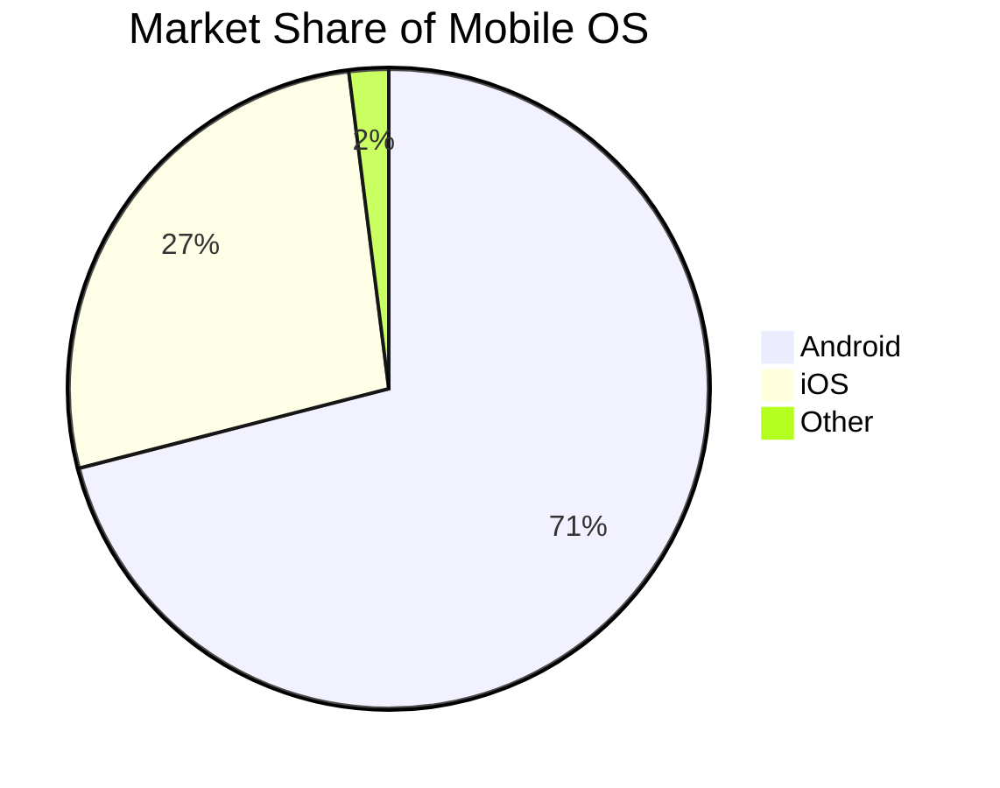
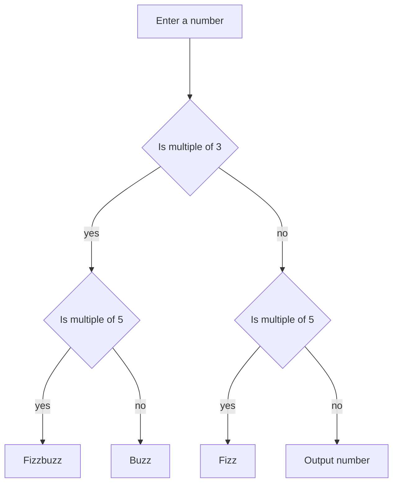
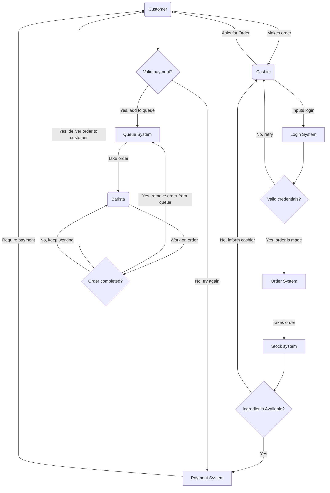

# Mermaid-stuff

```mermaid
pie title Market Share of Mobile OS
    "Android" : 71
    "iOS" : 27
    "Other" : 2
```

```mermaid
flowchart TD
    a[Enter a number] ---> b{Is multiple of 3}
    b --->|yes| c{Is multiple of 5}
    c --->|yes| d[Fizzbuzz]
    c --->|no| e[Buzz]
    b --->|no| f{Is multiple of 5}
    f --->|yes| g[Fizz]
    f --->|no| h[Output number]
```

```mermaid
flowchart TD
    n1(Customer) --->|Makes order|n2(Cashier)
    n2(Cashier) --->|Asks for Order|n1
    n2 --->|Inputs login|n3[Login System]
    n3 --->n4{Valid credentials?}
    n4 --->|Yes, order is made|n5[Order System]
    n4 --->|No, retry|n2
    n5 --->|Takes order| n6[Stock system]
    n6 --->n7{Ingredients Available?}
    n7 --->|No, inform cashier|n2
    n7 --->|Yes| n8[Payment System]
    n8 --->|Require payment| n1
    n1 --->n9{Valid payment?}
    n9 --->|Yes, add to queue|n10[Queue System]
    n9 --->|No, try again|n8
    n10 --->|Take order|n11(Barista)
    n11 --->|Work on order|n12{Order completed?}
    n12 --->|Yes, remove order from queue|n10
    n12 --->|Yes, deliver order to customer|n1
    n12 --->|No, keep working|n11
```
